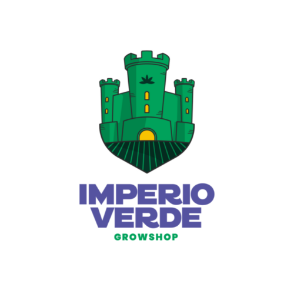
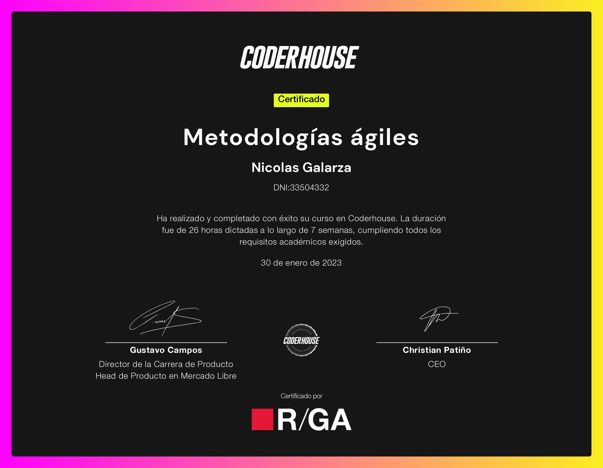
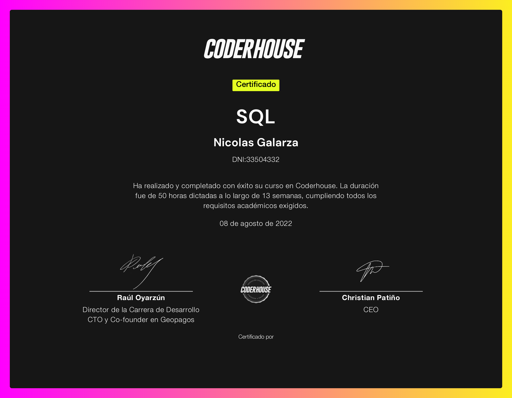
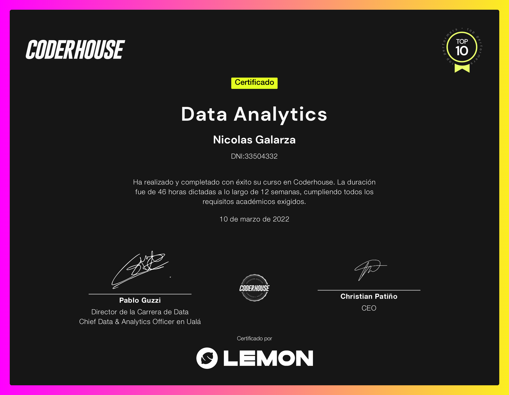

# drsaturno.github.io
<!doctype html>
<html lang="es">
  <head>
    <meta charset="utf-8">
    <meta name="viewport" content="width=device-width, initial-scale=1">
    <title>CV Nicolas Galarza</title>
    <link href="https://cdn.jsdelivr.net/npm/bootstrap@5.3.0-alpha1/dist/css/bootstrap.min.css" rel="stylesheet" integrity="sha384-GLhlTQ8iRABdZLl6O3oVMWSktQOp6b7In1Zl3/Jr59b6EGGoI1aFkw7cmDA6j6gD" crossorigin="anonymous">
    <link rel="icon" href="Imagenes/Logo saturno negro.png">
    
      

        <header class="d-flex align-items-center py-3 mb-4 border-bottom">
        
            
Proyecto CV - Nicolás Galarza

        </header>
      

     </head>
  <body>
    

    

      

        

          
        

        

          <h1 class="display-5 fw-bold lh-1 mb-3">¡Hola! Soy Nico, especialista en growth marketing. </h1>
          
¡Gracias por dedicar tu tiempo e interés en conocer más acerca de mí y mi trabajo! Si estás buscando un profesional en marketing y embudos de venta, ¡me alegra que nos hayamos conocido!

          

            <a href="contacto.html" class="btn btn-success btn-lg px-4 me-md-2"target="_blank">Escribime</a>
          

        

      

    

    

    

        <h2 class="pb-2 border-bottom">En mi vas a encontrar una persona...</h2>
        

          

            

              
              <lord-icon
              src="https://cdn.lordicon.com/nxaaasqe.json"
              trigger="loop"
              delay="2000"
              style="width:250px;height:250px">
            </lord-icon>
            

            <h3 class="fs-2">Metódica</h3>
            
Lo que me permite ser organizado y consistente en mi trabajo para lograr resultados efectivos y eficientes.

            

          

            

              
              <lord-icon
              src="https://cdn.lordicon.com/iltqorsz.json"
              trigger="loop"
              delay="2000"
              style="width:250px;height:250px">
            </lord-icon>
            

            <h3 class="fs-2">Estratega</h3>
            
Planifico con visión a largo plazo y tomo decisiones estratégicas de manera eficiente para alcanzar objetivos con éxito.

            

          

            

              
              <lord-icon
              src="https://cdn.lordicon.com/gqdnbnwt.json"
              trigger="loop"
              delay="2000"
              style="width:250px;height:250px">
            </lord-icon>
            

            <h3 class="fs-2">Análitica</h3>
            
Un enfoque lógico y detallado permite analizar situaciones complejas y tomar decisiones de manera mas eficiente y efectiva.

            

        

      

      <h2 class="visually-hidden">experiencia en Marketing</h2>

      

        
          <lord-icon
              src="https://cdn.lordicon.com/imamsnbq.json"
              trigger="click"
              style="width:250px;height:250px">
          </lord-icon>
          <h2 class="display-5 fw-bold">Pero sobre todo ... una persona.</h2>
          

            
Llevo más de 7 años trabajando y capacitándome para perfeccionar mis habilidades profesionales. De esta forma, puedo ayudarte a lograr resultados más eficientes y efectivos en tu proyecto.

            

          

          

      

       

        <h2 class="pb-2 visually-hidden">habilidades profesionales</h2>  
        

          

            <h2 class="display-5 fw-bold lh-1 mb-3 text-lg-start">Habilidades:</h2>
            
Con mi experiencia en ventas en línea y habilidades en marketing digital y e-commerce, puedo ayudar a su negocio a destacarse en línea. Me enorgullezco de ofrecer un servicio integral y personalizado a mis clientes.

          

        

          

            

              

                <svg class="bi" width="1em" height="1em">              
                </svg>
              

              <h4 class="fw-semibold mb-0">Embudos de conversion</h4>
              
Capaz de optimizar procesos y aumentar la eficiencia en la conversión de clientes potenciales en clientes reales.

            
  
            

              

                <svg class="bi" width="1em" height="1em">
               </svg>
              

              <h4 class="fw-semibold mb-0">Analitica de datos</h4>
              
Habilidades en análisis de datos, incluyendo la interpretación de resultados y la identificación de tendencias para tomar decisiones informadas y mejorar el rendimiento.
              

            
  
            

              

                <svg class="bi" width="1em" height="1em">
                </svg>
              

              <h4 class="fw-semibold mb-0">Pauta publicitaria</h4>
              
Habilidades en planificación y ejecución de estrategias publicitarias efectivas, incluyendo la selección de canales de publicidad y la creación de anuncios atractivos.

            
  
            

              

                <svg class="bi" width="1em" height="1em">
              </svg>
              

              <h4 class="fw-semibold mb-0">Creacion de dashboard</h4>
              
Creación de dashboards personalizados para la visualización y análisis de datos de manera efectiva y clara, que permiten una mejor toma de decisiones.

            

          

        

      

    

    

  

  

  

      <h2 class="pb-2 border-bottom">Empresas que confian en mi:</h2>
      

        

          

            
            

          

        

          

            
          

        

        

          

        
          

        

      

    

    

    

      

        

          
        

        

          <h2 class="display-5 fw-bold lh-1 mb-3">Estudios:</h2>
          
Actualmente estoy cursando las últimas materias de la licenciatura en Marketing en la Universidad FASTA. Durante estos años, he adquirido un amplio conocimiento en el área, y estoy emocionado por poder aplicar todo lo aprendido en mi futuro profesional. Esta carrera me ha brindado una visión integral del mundo del marketing, desde la investigación de mercado y análisis de datos hasta la planificación estratégica y la implementación de campañas publicitarias conocido!

          

          

        

      

    

    

    

      <h2 class="pb-2 border-bottom">Cursos y capacitaciones:</h2>
      

        

          

            <title>Metodologias Agiles</title><rect width="100%" height="100%">
              

                
Metodologias Ágiles

                

                  

                    <a href="https://www.coderhouse.com/certificados/63fa978ec1901d000ee486e1" target="_blank" rel="noopener noreferrer" class="btn btn-sm btn-success">Ver</a>
                  

                

              

              
          

        

        

          

            <title>SQL</title><rect width="100%" height="100%">
              

                
SQL

                

                  

                    <a href="https://www.coderhouse.com/certificados/6319624463e000001afc088f" target="_blank" rel="noopener noreferrer" class="btn btn-sm btn-success">Ver</a>
                  

                

              

          

        

        

          

            <title>Data Analytics</title><rect width="100%" height="100%">
              

                
Data Analytics

                

                  

                    <a href="https://www.coderhouse.com/certificados/624ec417059cd9001a3a5899" target="_blank" rel="noopener noreferrer" class="btn btn-sm btn-success">Ver</a>
                  

                

              
    

</body>
</html>
